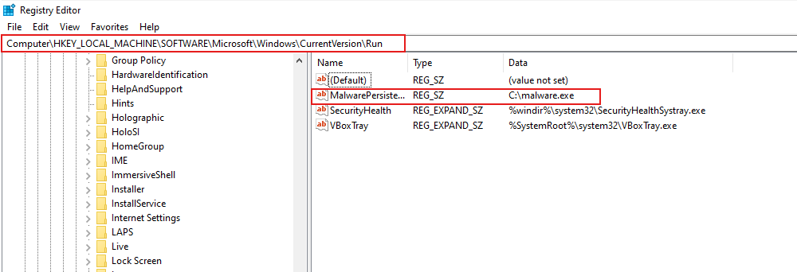
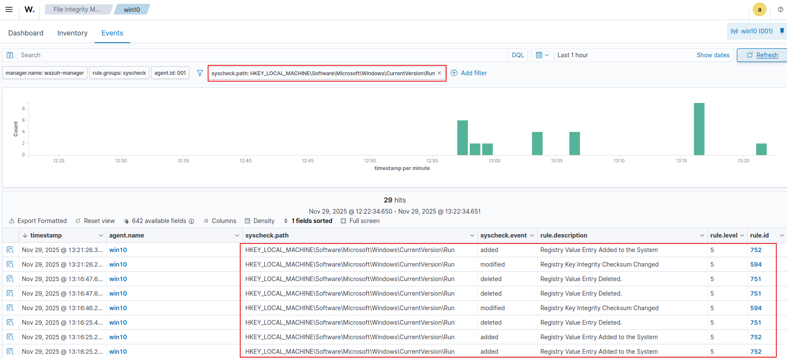
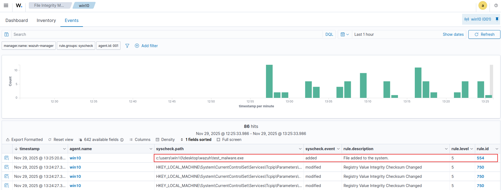
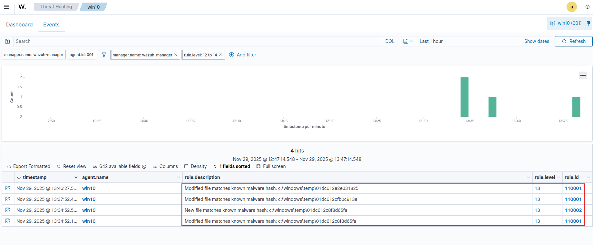
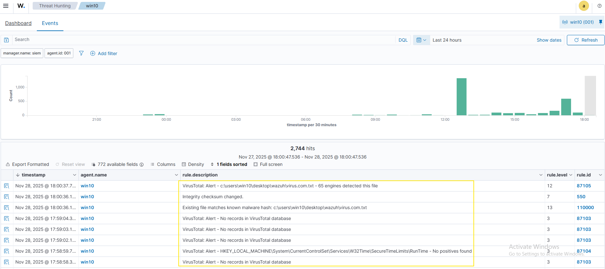
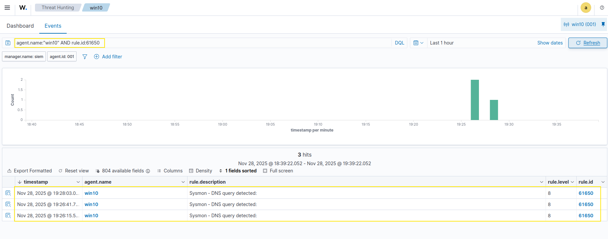
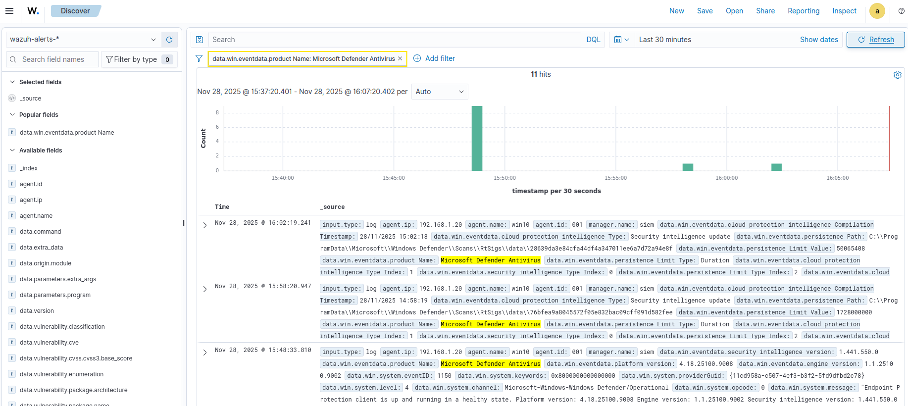
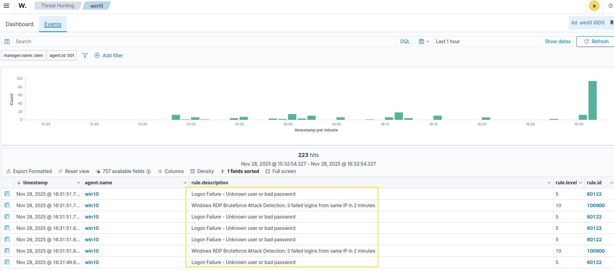
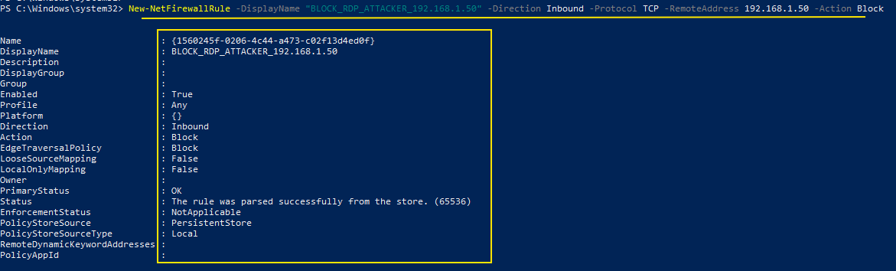

# SOC Monitoring Lab - Wazuh, Sysmon & Threat Response

Hands-on SOC lab focused on real attacks, real detections, and automated responses using a lightweight but effective enterprise setup.

---

- Demonstrate practical threat detection, endpoint monitoring, and automated remediation using:

  - Wazuh SIEM
  - Sysmon (Windows visibility)
  - Linux security logs
  - VirusTotal integration
  - Active Response automation

---

## Lab Environment

| Component             | Role                             |
| --------------------- | -------------------------------- |
| Wazuh Manager (Linux) | Central SIEM & response engine   |
| Windows 10 Endpoint   | Wazuh Agent + Sysmon             |
| Linux Endpoint        | SSH monitoring & Active Response |

Controlled attacks were executed to validate detection rules, FIM monitoring, malware hash identification, persistence detection, and automated blocking mechanisms across both Windows and Linux systems.

---

## Key Attacks & Detections

### Windows Registry Persistence

- **MITRE**: T1547.001
- **Action**: Add/remove Run key
- **Command**:

```sh
Set-ItemProperty "HKLM:\SOFTWARE\Microsoft\Windows\CurrentVersion\Run" -Name "MalwarePersistence" -Value "C:\malware.exe"
```

- Wazuh Detection: Monitors Run key changes and alerts on suspicious entries




### File Integrity Monitoring (FIM)

- **Action**: Detect file creation/modification
- **Directory Monitored**: `C:\Users\win10\Desktop\wazuh`

- **Test**: `echo "test_malware" > C:\Users\win10\Desktop\wazuh\test_malware.exe`

- Wazuh Detection: Logs and alerts on new or modified files



### Malware Hash Detection

- **MITRE**: T1204.002
- **Action**: Match file hashes with known malware
- **Hash List**: `/var/ossec/etc/lists/malware-hashes`

```sh
e0ec2cd43f71c80d42cd7b0f17802c73:mirai_botnet
55142f1d393c5ba7405239f232a6c059:xbash_malware
5d41402abc4b2a76b9719d911017c592:test_hello
```

- Wazuh Detection: Alerts on known malware hashes and triggers automatic response



### VirusTotal Integration + Automatic File Removal

- **Action**: Detect file -> Send hash to VirusTotal -> Auto-delete

- Test File: `Invoke-WebRequest https://secure.eicar.org/eicar.com.txt -OutFile "virus.com.txt"`

- **Flow**: Wazuh detects file -> sends hash to VirusTotal -> malware detected -> triggers removal -> file deleted automatically



### Sysmon Threat Hunting (Windows)

- Monitored Events:

  - Event ID 22 -> DNS Query
  - Event ID 1 -> Process Creation
  - Event ID 3 -> Network Connection
  - Event ID 10 -> Process Injection

- Detects suspicious behavior and forwards alerts to Wazuh



### Windows Defender Alerts

- Defender alerts forwarded to Wazuh for correlation



### RDP Brute Force Detection

- **MITRE**: T1110.003
- **Action**: 3 failed logins -> Firewall block via Wazuh Active Response

```sh
<rule id="100900" level="10" frequency="3" timeframe="120">
  <if_matched_sid>60122</if_matched_sid>
  <description>RDP Bruteforce detected</description>
</rule>
```



- Auto-Response:



---

### SSH Brute Force Detection (Linux)

- **MITRE**: T1110
- **Action**: 3 failed SSH logins -> IP blocked via iptables & Wazuh Active Response

- Attack Simulation:

```sh
hydra -l root -P passwords.txt ssh://192.168.1.40
iptables -A INPUT -s attacker_ip -j DROP
```

### PAM Account Protection

- **Action**: 3 failed login attempts -> account disabled automatically via Wazuh rule

```sh
<rule id="120100" level="10" frequency="3" timeframe="120">
  <if_matched_sid>5503</if_matched_sid>
  <description>Password guessing attack detected</description>
</rule>
```

- Auto-Response: Account automatically disabled via `disable-account`

---

### Lessons Learned (Wazuh SOC Lab)

- Wazuh rules detect persistence early (registry, scheduled tasks, SSH brute-force).
- Combining endpoint and network monitoring improves detection of exfiltration.
- Sysmon + Wazuh rules catch obfuscated PowerShell and suspicious processes.
- Automated responses (firewall, Active Response) work fast but need careful tuning.
- Wazuh logs provide a clear audit trail for investigation and forensics.

This lab demonstrated that Wazuh can reliably detect and respond to attacks on both Windows and Linux endpoints.
All simulated threats were detected and automatically mitigated in under 60 seconds, showing the effectiveness of Wazuh rules, Active Response, and combined endpoint-network monitoring.
